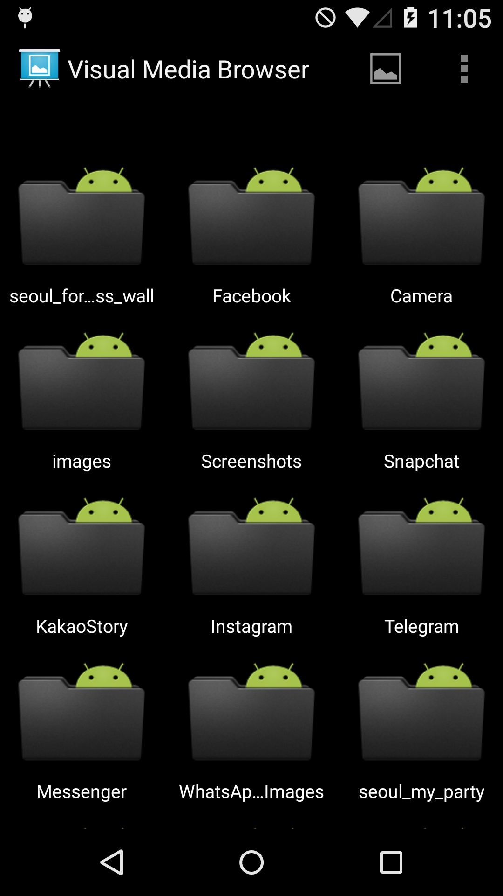
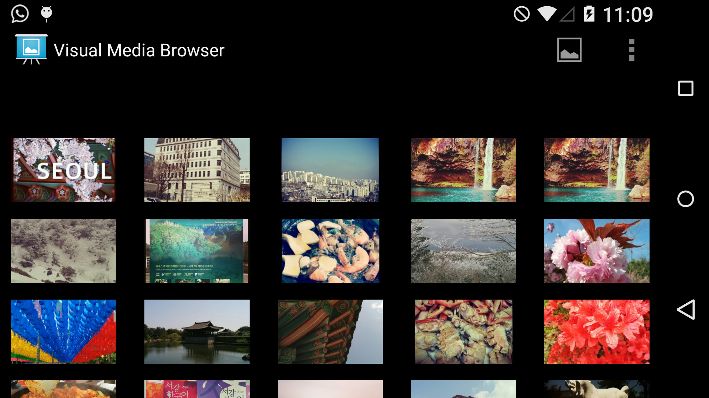

Android Media Database Example (Original DisplayingBitmaps Sample ([1])
===================================

Curent Version 1.0 Beta
-----------------------
Sample demonstrating how to load large bitmaps from Android sd card (Gallery) efficiently off the main UI thread,
caching bitmaps (both in memory and on disk), managing bitmap memory and displaying
bitmaps in UI element - GridView.

Introduction
------------

This is a sample app for the Android Media Store class ( Images and Videos for now, Audio will be added later).

It demonstrates how to load large bitmaps efficiently off the main UI thread, caching
bitmaps (both in memory and on disk), managing bitmap memory and displaying bitmaps
in UI elements such as GridView.

It queries the Android MediaStore Database and fetch all images and videos. Then use ImageCache Class (and DiskCache) for caching bitmaps. 

[1]: http://developer.android.com/training/displaying-bitmaps/

Pre-requisites
--------------

- Android SDK v21
- Android Build Tools v21.1.1
- Android Support Repository

Screenshots
-------------

  

Getting Started
---------------

This sample uses the Gradle build system. To build this project, use the
"gradlew build" command or use "Import Project" in Android Studio.

Support for DislpayingBitmaps
-----------------------------

- Google+ Community: https://plus.google.com/communities/105153134372062985968
- Stack Overflow: http://stackoverflow.com/questions/tagged/android

If you've found an error in this sample, please file an issue:
https://github.com/googlesamples/android-DisplayingBitmaps

Patches are encouraged, and may be submitted by forking this project and
submitting a pull request through GitHub. Please see CONTRIBUTING.md for more details.

License
-------

Copyright 2014 The Android Open Source Project, Inc.

Licensed to the Apache Software Foundation (ASF) under one or more contributor
license agreements.  See the NOTICE file distributed with this work for
additional information regarding copyright ownership.  The ASF licenses this
file to you under the Apache License, Version 2.0 (the "License"); you may not
use this file except in compliance with the License.  You may obtain a copy of
the License at

http://www.apache.org/licenses/LICENSE-2.0

Unless required by applicable law or agreed to in writing, software
distributed under the License is distributed on an "AS IS" BASIS, WITHOUT
WARRANTIES OR CONDITIONS OF ANY KIND, either express or implied.  See the
License for the specific language governing permissions and limitations under
the License.
